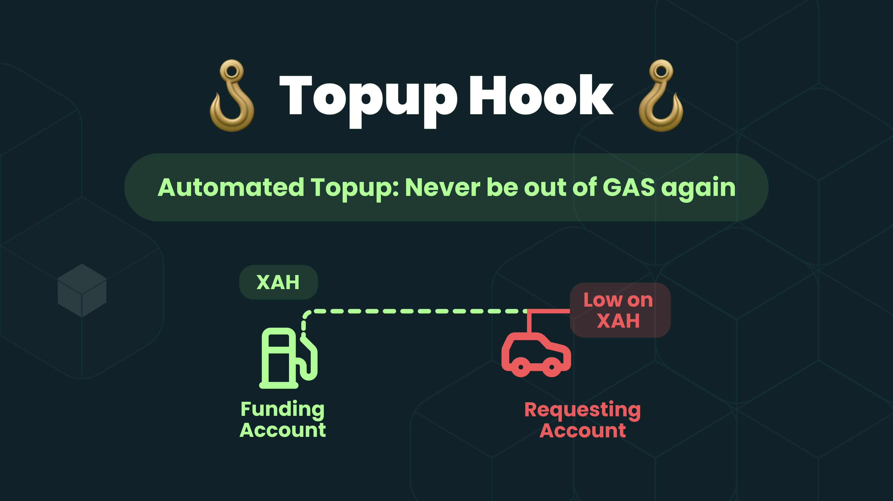

# Smart Contract: Automated XAH Topup System

## Overview

This smart contract system consists of two hooks that work together to enable automated XAH topup functionality. The system allows accounts to request XAH from designated funding accounts when their balance falls below a specified threshold.

---

## System Components

### 1. Requesting Account (Hook 1)

Installed on accounts that need automatic topups.

**Hook Parameters:**

- `D`: Destination account address (the funding account to request XAH from)
- `A`: Minimum balance threshold (triggers request when the requesting account's balance falls below this amount)

**Transaction Type:**

- HookOn to Payment transaction.

### 2. Funding Account (Hook 2)

Installed on account that provide XAH to requesting accounts.

**Hook Parameters:**

- `B`: Global balance threshold (the requesting accounts can request topup only when their balance is below this threshold)

**Transaction Type:**

- HookOn to Invoke transaction.

---

## How It Works

### Requesting Account (Hook 1)

1. Monitors account balance during payment transactions
2. When balance falls below threshold `A`, automatically sends a request to the configured funding account
3. Can only request from pre-configured funding account (`D`)

### Funding Account (Hook 2)

1. Maintains a whitelist of authorized requesting accounts
2. For each whitelisted account, stores:
   - `D`: Destination (requesting) account address
   - `A`: Amount to send when requested
3. Validates requests against global balance threshold (`B`)
4. Automatically sends XAH when valid requests are received

---

### Important:

- The funding account must have enough XAH to cover all requests.
- Care must be taken while setting the global balance threshold(HookParameter B) of the funding account, and the minimum balance threshold(HookParameter A) of the requesting account. It's recommended to set them equal to each other. Or the requesting accounts balance threshold must be equal or less than the global request amount of the fuding account.

Example:

Case 1:
Hook 2: Global request amount = 100 XAH, Hook 1: Minimum balance threshold = 99 XAH.
Then the topup can be successful.

Case 2:
Hook 2: Global request amount = 100 XAH, Hook 1: Minimum balance threshold = 101 XAH.
Then the topup will fail.

Case 3:
Hook 2: Global request amount = 100 XAH, Hook 1: Minimum balance threshold = 99 XAH.
Then the topup can be successful.

Case 4:
Hook 2: Global request amount = 100 XAH, Hook 1: Minimum balance threshold = 101 XAH.
Then the topup will fail.

---

---

## Use Case Example

1. Requesting account has 100 XAH. And it's threshold is set to 100 XAH.
2. Funding account sets global threshold (`B`) to 100 XAH
3. When requesting account's balance drops below its configured threshold (`A`) i.e., 100 XAH
4. Request is only processed if current balance < global threshold (`B`) i.e., 100 XAH
5. Funding account sends pre-configured amount (`A`), to the requesting account.

---

## Important Notes

- Funding account can whitelist multiple requesting accounts.
- Each whitelisted account can have its own topup amount configured by funding account.
- Requests are only processed if the requesting account's balance is below both its local threshold(set be requesting account) and the global threshold(set by funding account).
- The system provides automated liquidity management for accounts that need to maintain minimum balances.

---

### Use Case Example:

Authorize and automatically top-up Evernode instances(subscription or pull payment).

---

### Tips for people who want to build an UI for this system

While installing the hook, make sure you don't overrite the existing hook.
When the user inputs their raddress, check their account_objects for type hook. If there are hooks already installed, then leave those many hook positions while installing the new hook.

Also give optin to uninstall or delete the hook. Please remove the hook based on the hook position and also after checking the hookhash.

---

## Related Files

- [request.c](./request.c) - Implementation of Hook 1 (Requesting Hook)
- [payment.c](./payment.c) - Implementation of Hook 2 (Funding Hook)
